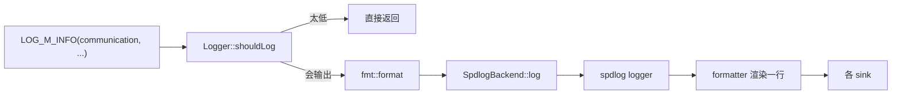
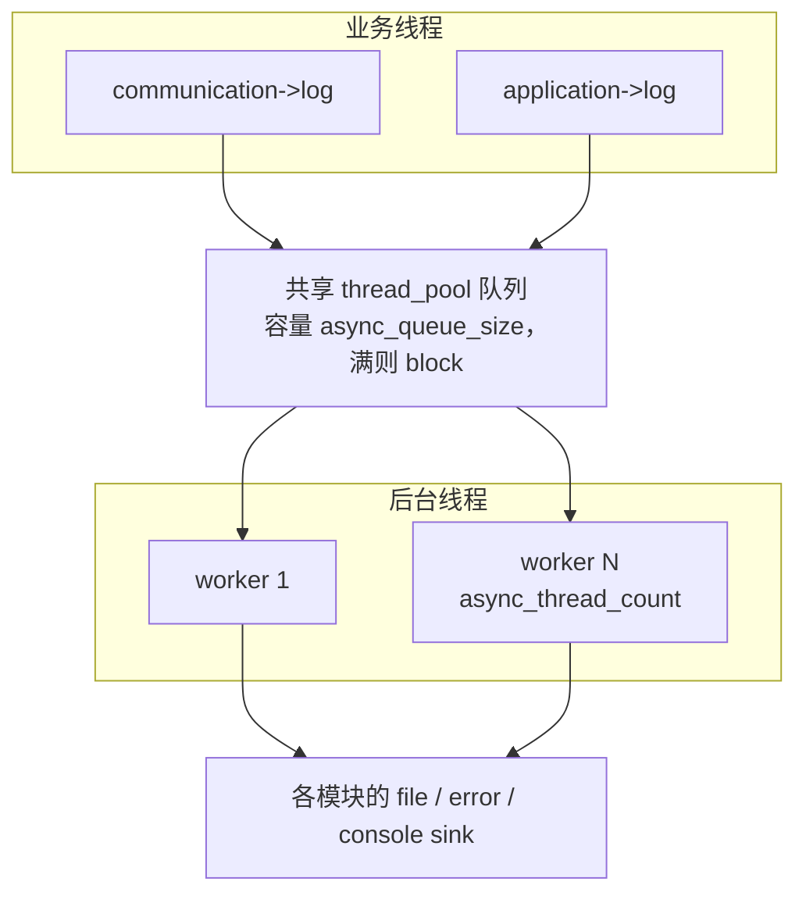
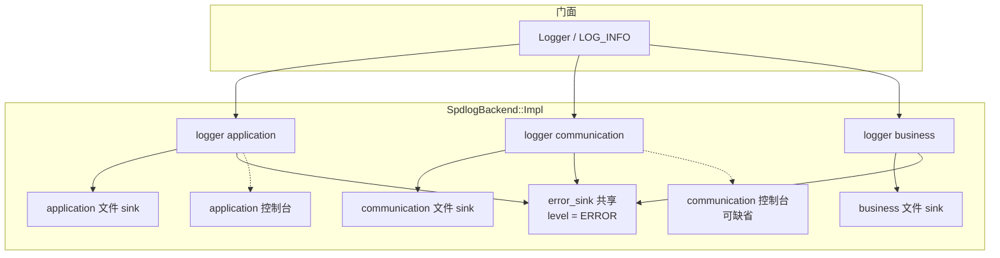

# spdlog 讲解与原理

本目录是 Logger 的 **spdlog 后端**。业务代码只走 `itflee::Logger` / `LOG_INFO`，看不到 `spdlog::`。这里说明 spdlog 本身怎么工作，以及本工程如何把它拼成「模块分文件 + error 汇聚 + 可选控制台」。

相关文件：

| 文件                        | 作用                                   |
| --------------------------- | -------------------------------------- |
| `spdlog_backend.h`        | `SpdlogBackend`，头文件不包含 spdlog |
| `spdlog_backend.cpp`      | logger / sink / 线程池 / 级别          |
| `timestamped_file_sink.h` | 自定义滚动 sink（时间戳文件名）        |

---

## 1. spdlog 是什么

spdlog 是 header-only 的 C++ 日志库。核心就四块，可以当成积木：

```text
                    ┌─────────────┐
  LOG_INFO("hi") →  │   logger    │  具名入口，先按 logger.level 过滤
                    └──────┬──────┘
                           │ log_msg（级别、时间、线程、正文、源位置）
                           ▼
                    ┌─────────────┐
                    │  formatter  │  把 log_msg 渲染成一行文本
                    └──────┬──────┘
                           │ 已格式化的字节
                           ▼
              ┌────────────┴────────────┐
              ▼                         ▼
        ┌──────────┐              ┌──────────┐
        │  sink A  │              │  sink B  │  每个 sink 再按自己的 level 过滤
        │  文件    │              │  控制台  │
        └──────────┘              └──────────┘
```

spdlog **没有**「模块配置」这种产品概念。它只提供：

- 任意多个具名 `logger`
- 一个 logger 挂任意多个 `sink`
- logger 级过滤 + sink 级过滤
- 同步写，或共享线程池异步写

「communication 不打控制台」是我们少给那个 logger 挂控制台 sink，不是 spdlog 的开关。

---

## 2. 四个核心对象

### 2.1 logger：具名入口

`spdlog::logger`（同步）或 `spdlog::async_logger`（异步）是打日志的入口。

一次 `logger->info("x")` 大致做：

1. `should_log(level)`：比 logger 自己的 level 还低就直接返回（本工程里 `Logger::shouldLog` 对应这一步，用来跳过 `fmt` 格式化）。
2. 组一条 `log_msg`（时间戳、线程 id、级别、payload、可选 `source_loc`）。
3. 交给所有 sink。异步时先入队，由后台线程再交给 sink。

本工程：**一个业务模块 = 一个 spdlog logger**，名字就是 `ModuleConfig::name`（`application` / `communication` / …）。

### 2.2 sink：真正落到哪里

sink 继承 `spdlog::sinks::sink`，常见实现：

- `stdout_color_sink_mt`：彩色控制台
- `rotating_file_sink_mt`：官方按大小滚动，文件名是 `xxx.log`、`xxx.1.log`、`xxx.2.log`
- 本目录的 `TimestampedRotatingFileSinkMt`：同样按大小滚动，但文件名是 `xxx_2026-09-08_16-06-04.log`

`base_sink<Mutex>` 会先加锁，再调子类的 `sink_it_` / `flush_`。多线程写同一个文件靠这把锁。

每个 sink 有自己的 `set_level`。logger 放行之后，sink 还可以再挡一层：

```text
  一条 DEBUG
       │
       ▼
  logger.level = INFO ? ──是──► 整条丢掉（sink 根本看不到）
       │否
       ▼
  逐个 sink：
    文件 sink.level = WARN  → DEBUG 不写文件
    控制台 sink.level = DEBUG → DEBUG 仍打屏幕
```

这就是「文件 Warn、控制台 Debug」能同时成立的原因。

### 2.3 formatter：行长什么样

默认是 `pattern_formatter`，模式串类似 strftime，再加 spdlog 自己的占位符：

| 占位符                   | 含义                                                                                        |
| ------------------------ | ------------------------------------------------------------------------------------------- |
| `%Y-%m-%d %H:%M:%S.%e` | 本地时间，毫秒                                                                              |
| `%E`                   | 本工程自定义：`INFO` / `WARN` / `ERROR` / `CRITICAL`（官方 `%l` 是小写 `info`） |
| `%s`                   | 源文件名（只要`log()` 时传了 `source_loc`）                                             |
| `%#`                   | 行号                                                                                        |
| `%t`                   | 线程 id                                                                                     |
| `%v`                   | 正文                                                                                        |

本工程两种模式：

- `source_location` 关：`[%Y-%m-%d %H:%M:%S.%e] [%E] [%s] [thread:%t] %v`
- 开：`[%s:%#]`，即 `[logger_test.cpp:123]`

`logger->set_formatter(...)` 会 clone 一份到**每个** sink。之后改 logger 的 formatter 不会自动改已经挂上的 sink。

### 2.4 注册表

`spdlog::register_logger` 把 logger 放进全局 map，可用 `spdlog::get("application")` 取回。`drop_all()` / `shutdown()` 清掉 logger 和异步线程池。本后端 `init` 前会 `drop_all()`，`shutdown` 时 `spdlog::shutdown()`。

---

## 3. 一条日志的完整路径

业务侧先用 fmt 把 `{}` 拼成字符串（级别不够则根本不拼），再交给后端：



后端内部（同步）：

```text
  SpdlogBackend::log
        │
        ▼
  modules["communication"].logger
        │
        ├── should_log?  （logger 总级别 = 文件、error、控制台里最细的那个）
        │
        ▼
  对每个 sink：
        sink->log(msg)
            ├── sink.level 再过滤
            ├── formatter_->format(msg) → 一行字节
            └── sink_it_：fwrite / 控制台 write / 必要时滚动文件
```

异步时，`logger->log` 只把 `log_msg` 丢进**共享线程池**的队列（满则 `block` 等到有空位），后台线程再走 formatter + sink。`shutdown()` / `flush()` 会等到队列排空。



和 Boost.Log 的差别：spdlog 是**一个池子喂所有 logger**；Boost.Log 异步是**每个 sink 自己一条投递线程**。

---

## 4. 本工程怎么拼这些积木

`init` 时按 `LoggerConfig::modules` 建图。共享一份 `error.log` sink；控制台按模块决定挂不挂（级别也可以每模块不同，所以不用全局共用一个 console sink）。

```text
                    Logger::get("communication")
                              │
                              ▼
                    spdlog logger "communication"
                              │
              ┌───────────────┼───────────────┐
              ▼               ▼               ▼
     TimestampedFile     error_sink     console_sink
     communication_*.log   （共享）      （仅该模块 console=true）
              │               ▲
              │               │
     logger "application" ────┘  同样挂 error_sink
              │
              ▼
     application_*.log
```

用 mermaid 画同一张关系：



虚线：`ModuleConfig::console == false` 时不挂控制台 sink。

### 级别怎么叠

对每个模块：

1. **文件 sink.level** = 该模块 `level`（空则全局 `LoggerConfig::level`）
2. **控制台 sink.level** = 该模块 `console_level`（空则全局）
3. **error sink.level** = ERROR（所有模块共用）
4. **logger.level** = 上面会真正用到的级别里**最细**的那个

这样 `should_log(DEBUG)` 在「文件 Warn、控制台 Debug」时仍为 true，DEBUG 能进控制台，但过不了文件 sink。

`setLevel(name, lv)` 只改该模块**文件**级别，再重算 logger.level；不改控制台开关。

---

## 5. 自定义滚动 sink

官方 `rotating_file_sink` 滚动后是：

```text
communication.log      ← 当前
communication.1.log    ← 上一份
communication.2.log
```

产品要的是打开/滚动时刻的本地时间：

```text
communication_2026-09-08_16-06-04.log
communication_2026-09-08_16-06-04_831.log   ← 同一秒冲突时加毫秒
```

所以继承 `base_sink<mutex>`，在 `sink_it_` 里：写之前若 `current_size + 本行 > max_size` 就关文件、`makeUniqueFilename()` 再打开，然后按 `max_files+1` 删最旧的同前缀文件。逻辑文件名仍是配置里的 `communication.log`，磁盘上从不出现这个光杆名字。

```text
  sink_it_(msg)
      │
      ├─ formatter 得到本行字节
      ├─ 超 max_size？ ──是──► close → 新时间戳文件名 → open → 修剪旧文件
      └─ write → current_size += n
```

---

## 6. 同步 vs 异步（本后端）

|              | 同步`spdlog::logger` | 异步`async_logger`                                      |
| ------------ | ---------------------- | --------------------------------------------------------- |
| 谁调用 sink  | 业务线程               | 线程池 worker                                             |
| 业务线程代价 | format + fwrite        | 入队（队列满则卡住）                                      |
| 线程池       | 无                     | `init_thread_pool(queue_size, thread_count)` 进程内一份 |
| 丢日志       | 不会                   | `block` 策略下不会丢，会堵调用方                        |
| shutdown     | flush 各 logger        | 先排空队列再停线程                                        |

`async=true` 时所有模块的 `async_logger` **共用同一个** `spdlog::thread_pool()`。`async_thread_count` 只对这个后端有意义。

---

## 7. 和公开 API 的对应

```text
  include/base/log/logger.h          业务只依赖这里
              │
              ▼
  src/base/log/logger.cpp            按 config.backend 选实现
              │
              ▼
  src/base/log/spdlog/*              本目录：spdlog 类型全部关在 .cpp
```

公开头里不能出现 `spdlog` 头文件；`{}` 格式化用的是 spdlog 自带的 `fmt`（`bundled/format.h`）。换 Boost.Log 后端时宏和 `Logger` 不变。

---

## 8. 使用时注意

- **init / shutdown** 不能和打日志并发；进程内只 init 一次，换后端要先 shutdown。
- 热路径先 `shouldLog`，级别不够不要拼字符串。宏已经这样做了。
- 不要在 sink/formatter 里再打 `LOG_*`（不可重入）。
- 未 init 或 init 失败：写 stderr，不经过 spdlog。
- `WARN+` 与 `CRITICAL` 会立刻 `flush`（`flush_level`）。
